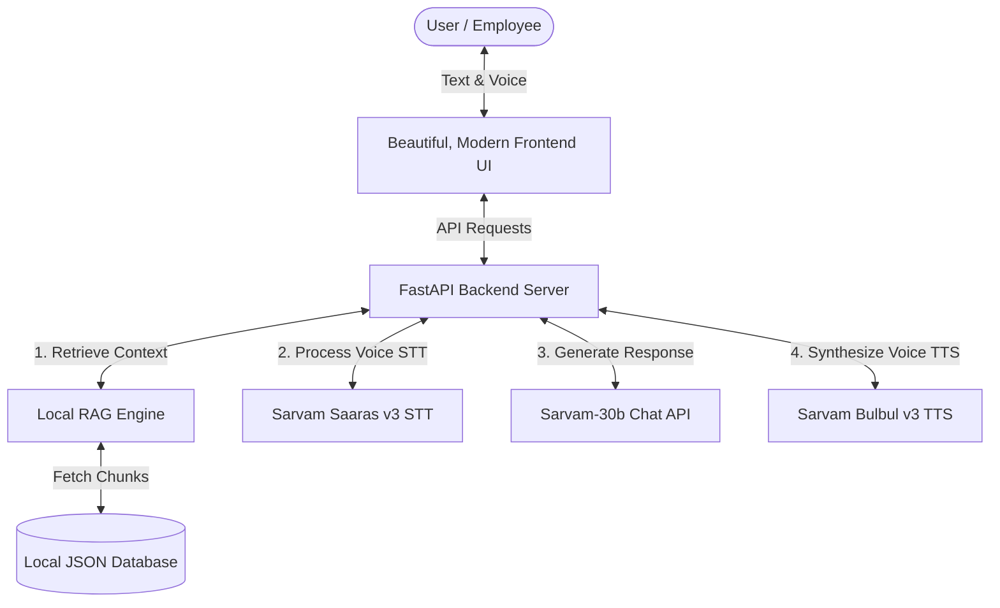

# 🇮🇳 Sarvam AI Enterprise Assistant

An enterprise-grade, highly responsive, and visually stunning corporate chatbot utilizing **Sarvam AI** APIs to deliver high-quality, multi-lingual, voice-enabled, and domain-knowledge-grounded answers. Optimized for Indian regional languages, the application integrates text-to-voice (TTS), voice-to-text (STT), and custom document uploading (RAG).



---

## 🌟 Key Features

*   **India-Centric Multi-lingual Intelligence:** Powered by `sarvam-30b`, allowing professional corporate conversation in English and 10+ Indian languages (Hindi, Bengali, Tamil, Telugu, Kannada, Malayalam, Marathi, Gujarati, Punjabi, and more).
*   **📷 Sarvam Vision OCR & Layout Preservation:** Scans images (PNG, JPG, WEBP) or scanned PDFs on-the-fly. Orchestrates an async backend pipeline with Azure S3 uploads, status polling, and **in-memory zip extraction** to parse documents and complex tables into clean Markdown format. Features a sliding scanning laser visual overlay. Detailed specs are available in the [OCR Documentation](ocr_documentation.md).
*   **Local RAG Grounding:** Upload enterprise PDFs, TXT, MD, or JSON files. They are parsed, chunked, and indexed locally into a TF-IDF keyword search engine. Relevant snippets are injected automatically into the LLM system prompt.
*   **🎙️ Speech-to-Text Input (STT):** Speak directly into your microphone in any supported Indian language using the high-performance **Sarvam Saaras v3** engine to auto-transcribe and submit queries.
*   **🔊 Text-to-Speech Output (TTS):** Beautiful voice synthesization of chatbot replies using the state-of-the-art **Sarvam Bulbul v3** model. Supports multiple high-fidelity Indian speaker voices (Ritu, Aditya, Shubh) and variable speech speed.
*   **✨ Premium Dark Theme & Micro-animations:** Fully responsive design with glassmorphic layouts, animated pulse listening states, voice wave visuals, sliding preferences panel, and sleek theme toggles.
*   **🛠️ Demo Mode:** Runs immediately out of the box even without a Sarvam API key, offering custom interactive guidelines, mock voice responses, and system walkthroughs.

---

## 📂 Project Architecture

```
/sarvamai_chatbot
│
├── ocr_documentation.md        # Technical specs, architecture sequences, and usage guide for OCR
├── /backend                    # FastAPI Backend Server
│   ├── app/
│   │   ├── config.py           # Server port, host, and storage directories
│   │   ├── main.py             # FastAPI App, router endpoints, CORS, & logging
│   │   └── services/
│   │       ├── rag_engine.py    # Document parsing, character-sentence chunker, TF-IDF ranker
│   │       └── sarvam_client.py # HTTP wrappers for Sarvam Chat completions, Saaras STT, & Bulbul TTS
│   ├── db/                     # Autogenerated directory for RAG index storage
│   ├── uploads/                # Autogenerated directory for uploaded PDF/text sources
│   ├── .env.example            # Environment configurations template
│   └── requirements.txt        # Backend dependencies (fastapi, uvicorn, requests, pypdf, etc.)
│
└── /frontend                   # Pure HTML/CSS/JS Static Client (No complex build steps!)
    ├── app.js                  # Audio recorder, network fetching, markdown formatter, and DOM actions
    ├── index.css               # Outfit/Jakarta fonts, custom HSL styling, and dark theme design
    └── index.html              # Modern, glassmorphic grid layout structure
```

---

## 🚀 Setup & Execution Guide

### 1. Backend Server Setup

#### Prerequisites
Ensure you have **Python 3.8+** installed on your operating system.

#### Installation Steps
1. Open your terminal or Command Prompt and navigate to the `backend` folder:
   ```bash
   cd backend
   ```

2. Create a virtual environment to isolate project packages:
   ```bash
   python -m venv venv
   ```

3. Activate the virtual environment:
   * **Windows (Command Prompt):**
     ```cmd
     venv\Scripts\activate
     ```
   * **Windows (PowerShell):**
     ```powershell
     .\venv\Scripts\Activate.ps1
     ```
   * **macOS / Linux:**
     ```bash
     source venv/bin/activate
     ```

4. Install the required dependencies:
   ```bash
   pip install -r requirements.txt
   ```

5. Configure environment variables:
   * Copy the example file to a new `.env` file:
     ```bash
     copy .env.example .env
     ```
     *(Use `cp .env.example .env` on macOS or Linux)*
   * Open the `.env` file in your text editor.
   * If you have a Sarvam AI API subscription key, configure it there:
     ```env
     SARVAM_API_KEY=your_real_sarvam_api_key_here
     PORT=8000
     HOST=127.0.0.1
     ```
     *Note: If you leave `SARVAM_API_KEY` blank or unchanged, the backend automatically operates in **Demo Mode**, yielding highly interactive walkthrough prompts and mock completions so you can still preview the UI and local RAG functionalities.*

6. Start the FastAPI server:
   ```bash
   python app/main.py
   ```
   The backend service is now running at **`http://127.0.0.1:8000`**.

---

### 2. Frontend Client Setup

Because the frontend is built entirely on native web standards (HTML5, Vanilla CSS, Modern ES6 Javascript), there are **no package installations or compilers required**!

To launch the frontend:

#### Option A: Quick Double-Click (Local File)
Simply browse to the `frontend/` directory and open **`index.html`** in your favorite browser (Chrome, Edge, Firefox, Safari).

#### Option B: Serve via Local HTTP Server (Recommended)
Running through an HTTP server ensures full compatibility with browser permissions (like microphone capture for voice chat).

* **Using Python:**
  Open a new terminal window, navigate to the `frontend` folder, and run:
  ```bash
  python -m http.server 3000
  ```
  Then open **`http://localhost:3000`** in your browser.

* **Using Node.js (`npx`):**
  If you have Node.js installed, open a terminal in the `frontend` directory and run:
  ```bash
  npx serve
  ```

* **Using VS Code Extensions:**
  If you use Visual Studio Code, you can install the **Live Server** extension, open the `frontend` directory, and click the **"Go Live"** button in the bottom status bar.

---

## 💡 How to Use the Application

1. **System Status Check:** 
   Once the page loads, look at the sidebar under **System Status**. If the backend server is active, it will display a green **"Connected"** badge. If no API key is specified, it will display a yellow **"Demo Mode"** badge.
2. **Uploading Grounding Documents:**
   * In the sidebar under **Knowledge Grounding**, drag and drop a PDF, TXT, MD, or JSON document into the dropzone (or click the browse link to select one).
   * The file will automatically upload and be parsed. 
   * A notification bubble will confirm how many text chunks were loaded into the database, and the document name will appear in the **Indexed Source Files** list.
3. **Conversing with RAG Grounding:**
   * Enter a query in the message box.
   * If RAG Grounding is turned **ON** in the top header, the chatbot will retrieve custom information from your uploaded files, ground its answer, and display a list of **Grounded Sources** used under its response bubble.
4. **Voice Chat & STT:**
   * Select your target language in the preferences dropdown (e.g. Hindi or Bengali).
   * Click the **microphone icon** in the input bar. Allow browser microphone access when prompted.
   * Speak clearly. When finished speaking, click **"Done"**. The backend will transcribe your voice using Saaras v3, populate it in the text area, and automatically submit it.
5. **Document Digitization & OCR Scanning:**
   * Select your preferred language in the Preferences sidebar (e.g. Kannada, Hindi, or Tamil) to act as a transcription script hint.
   * Click the **camera icon** next to the voice microphone in the chat input bar.
   * Select any local image (PNG, JPEG, WEBP) or scanned document PDF (Max 10MB).
   * A thumbnail preview will render immediately inside your message bubble, and a pulsing linear scanner animation will track the active OCR pipeline.
   * Within seconds, the backend unzips and extracts the document in-memory, delivering layout-preserved structured text and tables inside a Markdown bot bubble.
6. **Listening to Responses (TTS):**
   * Make sure **Auto-play TTS Voice Responses** is checked in the preferences, or click the **speaker icon** on any individual assistant message.
   * The audio synthesizes instantly using Bulbul v3 and plays back via a sleek floating control bar at the bottom.

---

## 🛠️ Tech Stack & Service Breakdown

*   **Sarvam AI Services Integration:**
    *   **LLM Engine**: `sarvam-30b` (conversational reasoning optimized for Indian contexts).
    *   **Saaras v3**: Speech-to-Text dynamic transcription and translation.
    *   **Bulbul v3**: High-fidelity Text-to-Speech regional voice synthesis.
    *   **Sarvam Vision**: Asynchronous Document Digitization / Layout-preserving OCR pipeline.
*   **Backend Framework:** [FastAPI](https://fastapi.tiangolo.com/) - Extremely lightweight, high-performance, asynchronous Python web framework.
*   **PDF Parser:** [pypdf](https://pypi.org/project/pypdf/) - Pure-python PDF library capable of extracting text cleanly.
*   **Search Engine:** Custom Term Frequency-Inverse Document Frequency (TF-IDF) retrieval mechanism with smooth IDF calculations for super-fast keyword grounding without needing external docker containers.
*   **Frontend UI:**
    *   Responsive Sidebar & Main Chat grid layout.
    *   Custom HSL-tailored typography and vibrant color gradients.
    *   Voice record animation, pulsing network check, sliding preference sliders, and camera triggers.
