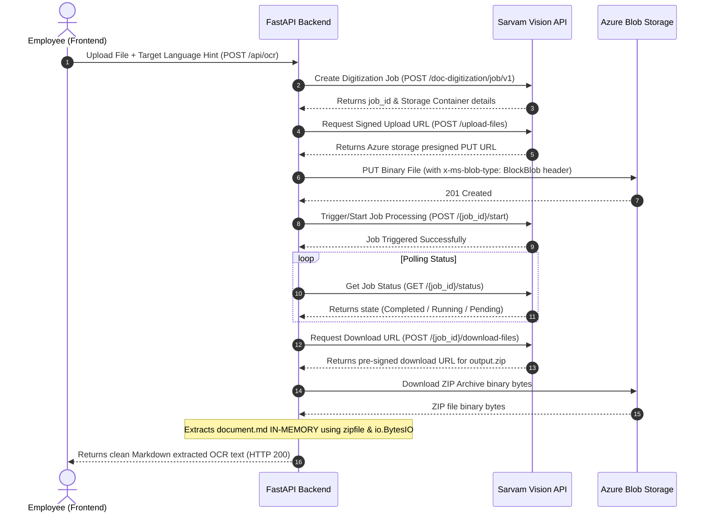

# 📷 Sarvam Vision Document Digitization & OCR Documentation

This document provides a detailed technical overview, architectural breakdown, and usage guide for the **Sarvam Vision Document Digitization (OCR)** pipeline integrated into the **Sarvam AI Enterprise Assistant**.

---

## 🌟 Feature Overview

Unlike generic OCR tools that only dump raw unstructured text, the **Sarvam Vision Document Digitization API** is designed specifically to capture complex, multi-lingual documents across English and 22 Indian regional languages. 

### Key Capabilities:
*   **Layout-Preserving Extraction**: Seamlessly preserves reading orders, headers, lists, paragraphs, and multi-column grids.
*   **Table Structure Extraction**: Converts complex tabular datasets directly into structured, clean Markdown table grids.
*   **Deep Regional Optimization**: Leverages language hints to extract text with outstanding accuracy in scripts like Devanagari, Kannada, Tamil, Bengali, Telugu, and more.
*   **High-Fidelity Visual Previews**: Displays base64 image attachments directly inside user chat bubbles, providing immediate visual feedback of the scanned file.
*   **Sleek Scanning Micro-animations**: Integrates an animated, pulsing linear scanner bar overlay on top of bubbles while asynchronous document digitization is processing on the server.

---

## ⚙️ Architectural Workflow

Because document intelligence can be computationally intensive, Sarvam AI runs Document Digitization as an **asynchronous, job-based workflow**. The FastAPI backend orchestrates this multi-stage transaction seamlessly:



---

## 🛠️ Technical Details & Implementation Highlights

### 1. Header Constraints (Azure S3 BlockBlobs)
Sarvam AI generates presigned storage URLs backed by Azure Blob Storage. When executing binary uploads via standard `PUT` requests, Azure rejects the transaction as `403 Forbidden` unless the correct blob structure header is provided. The backend handles this dynamically:
```python
put_headers = {
    "Content-Type": "application/pdf" if file_name.endswith(".pdf") else "image/png",
    "x-ms-blob-type": "BlockBlob" # Required by Azure Blob Storage presigned URLs
}
response = requests.put(presigned_url, data=file_bytes, headers=put_headers)
```

### 2. Case-Insensitive Polling Logic
The live API returns states like `"Completed"` (capital C) rather than standard uppercase `"COMPLETED"`. The polling logic implements a case-insensitive check to avoid infinite loops and timeouts:
```python
job_status = status_data.get("job_state") or status_data.get("status")
if job_status and job_status.upper() == "COMPLETED":
    break
```

### 3. In-Memory Zero-Disk Zip Extraction
To ensure speed, enterprise-grade safety, and keep the workspace directory free from clutter, the backend avoids downloading the `.zip` archive to local disk. Instead, the archive binary is streamed directly from memory:
```python
import zipfile
import io

zip_bytes = io.BytesIO(file_res.content)
with zipfile.ZipFile(zip_bytes) as z:
    namelist = z.namelist()
    md_file = next((name for name in namelist if name.endswith(".md")), None)
    if md_file:
        extracted_text = z.read(md_file).decode("utf-8")
```

### 4. Dynamic Language Hinting
The frontend's preferred **Target Language** dropdown values are mapped directly to BCP-47 codes (e.g. `kn-IN` for Kannada, `hi-IN` for Hindi) and passed down to step 1 of the digitization process, allowing the AI model to activate appropriate multi-lingual transcription weightings.

---

## 📱 Frontend UX Breakdown

1.  **Trigger Button**: Nestled beautifully in the text input container:
    ```html
    <button class="input-action-btn" id="ocr-btn" title="Scan Image/PDF (OCR)">
        <i class="fa-solid fa-camera"></i>
    </button>
    ```
2.  **Base64 FileReader Preview**: The file is instantly read inside `app.js` using `FileReader.readAsDataURL()` to append a high-fidelity local visual image thumbnail in the user bubble, preventing delays or external image hosting dependencies.
3.  **Active Scan Pulse overlay**: Applies a rolling cyan laser beam animation (`.ocr-scanning-indicator::after` utilizing CSS `@keyframes scan-pulse-line`) on top of the typing bubble to visually highlight ongoing extraction.

---

## 🚀 How to Use the OCR Scanner

1.  Select your preferred **Target Language** in the Preferences sidebar (e.g., Kannada, Hindi, Tamil).
2.  Click the **Camera Icon** in the chat input bar at the bottom.
3.  Choose an image (`.png`, `.jpg`, `.jpeg`, `.webp`) or a scanned `.pdf` document (Max 10 MB).
4.  The visual thumbnail will render immediately in the chat. A typing bubble showing an animated laser scanner line will trace down, indicating OCR is running.
5.  Within seconds, the structured, parsed Markdown text (including grids, colon layouts, and lists) is displayed inside a beautiful bot response bubble.

---

## 💡 Demo Mode Capability
If the system is run without a `SARVAM_API_KEY`, the application automatically falls back to **Demo Mode**. Clicking the camera and uploading a document will safely return an educational mock response illustrating the OCR's multi-lingual table extraction and layout alignment capabilities without throwing exceptions.
